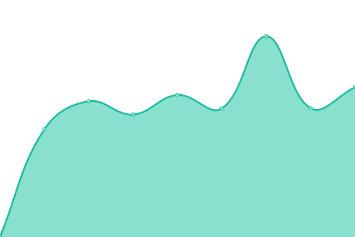
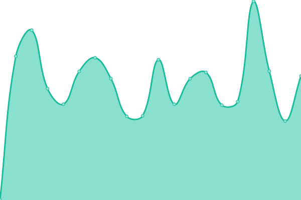
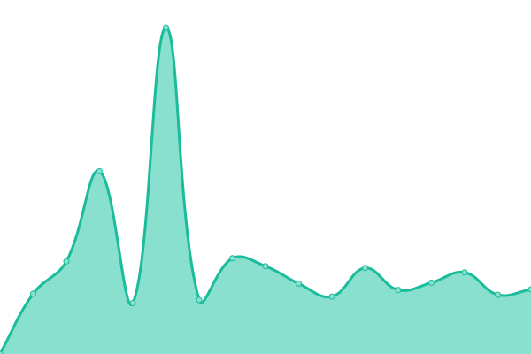
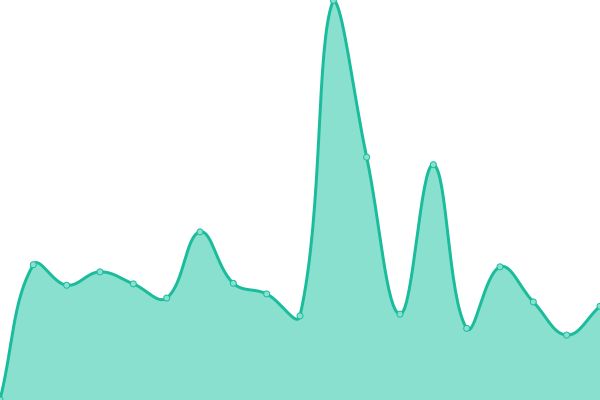
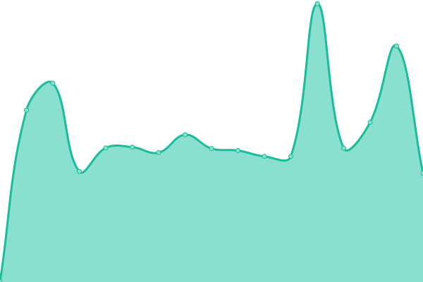
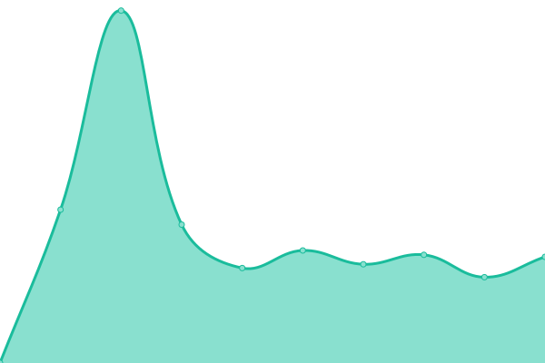
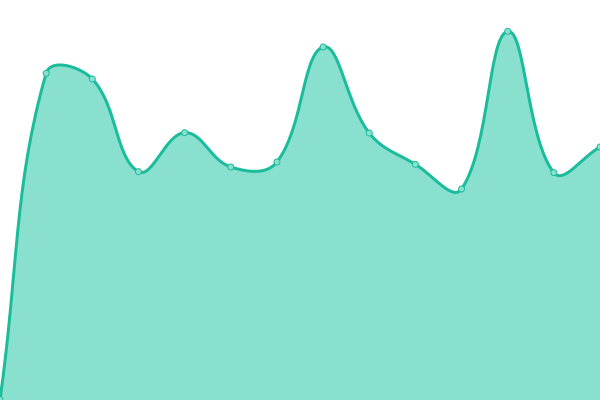
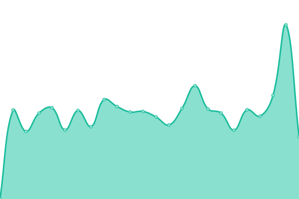

# [📈 Live Status](https://gdm257.github.io/upptime): <!--live status--> **🟧 Partial outage**

This repository contains the open-source uptime monitor and status page for [gdm257](https://gdm257.github.io/upptime), powered by [Upptime](https://github.com/upptime/upptime).

With [Upptime](https://upptime.js.org), you can get your own unlimited and free uptime monitor and status page, powered entirely by a GitHub repository. We use [Issues](https://github.com/gdm257/upptime/issues) as incident reports, [Actions](https://github.com/gdm257/upptime/actions) as uptime monitors, and [Pages](https://gdm257.github.io/upptime) for the status page.

<!--start: status pages-->
<!-- This summary is generated by Upptime (https://github.com/upptime/upptime) -->
<!-- Do not edit this manually, your changes will be overwritten -->
<!-- prettier-ignore -->
| URL | Status | History | Response Time | Uptime |
| --- | ------ | ------- | ------------- | ------ |
|  Status | 🟩 Up | [status.yml](https://github.com/gdm257/upptime/commits/HEAD/history/status.yml) | 

 868ms
     
 | 

<a href="https://gdm257.github.io/upptime/history/status">93.21%</a>
    

|  1Panel | 🟩 Up | [1-panel.yml](https://github.com/gdm257/upptime/commits/HEAD/history/1-panel.yml) | 

 862ms
     
 | 

<a href="https://gdm257.github.io/upptime/history/1-panel">100.00%</a>
    

|  Alist | 🟩 Up | [alist.yml](https://github.com/gdm257/upptime/commits/HEAD/history/alist.yml) | 

 881ms
     
 | 

<a href="https://gdm257.github.io/upptime/history/alist">94.12%</a>
    

|  Artalk | 🟩 Up | [artalk.yml](https://github.com/gdm257/upptime/commits/HEAD/history/artalk.yml) | 

 977ms
     
 | 

<a href="https://gdm257.github.io/upptime/history/artalk">100.00%</a>
    

|  Authelia | 🟩 Up | [authelia.yml](https://github.com/gdm257/upptime/commits/HEAD/history/authelia.yml) | 

 766ms
     
 | 

<a href="https://gdm257.github.io/upptime/history/authelia">100.00%</a>
    

|  BitWarden | 🟩 Up | [bit-warden.yml](https://github.com/gdm257/upptime/commits/HEAD/history/bit-warden.yml) | 

 866ms
     
 | 

<a href="https://gdm257.github.io/upptime/history/bit-warden">100.00%</a>
    

|  Dockge | 🟩 Up | [dockge.yml](https://github.com/gdm257/upptime/commits/HEAD/history/dockge.yml) | 

 692ms
     
 | 

<a href="https://gdm257.github.io/upptime/history/dockge">100.00%</a>
    

|  Duplicati | 🟩 Up | [duplicati.yml](https://github.com/gdm257/upptime/commits/HEAD/history/duplicati.yml) | 

 771ms
     
 | 

<a href="https://gdm257.github.io/upptime/history/duplicati">98.47%</a>
    

|  EteSync | 🟩 Up | [ete-sync.yml](https://github.com/gdm257/upptime/commits/HEAD/history/ete-sync.yml) | 

 916ms
     
 | 

<a href="https://gdm257.github.io/upptime/history/ete-sync">99.10%</a>
    

|  Frp | 🟩 Up | [frp.yml](https://github.com/gdm257/upptime/commits/HEAD/history/frp.yml) | 

 887ms
     
 | 

<a href="https://gdm257.github.io/upptime/history/frp">98.97%</a>
    

|  Gitea | 🟩 Up | [gitea.yml](https://github.com/gdm257/upptime/commits/HEAD/history/gitea.yml) | 

 731ms
     
 | 

<a href="https://gdm257.github.io/upptime/history/gitea">94.11%</a>
    

|  Grafana | 🟩 Up | [grafana.yml](https://github.com/gdm257/upptime/commits/HEAD/history/grafana.yml) | 

 1145ms
     
 | 

<a href="https://gdm257.github.io/upptime/history/grafana">100.00%</a>
    

|  LLDAP | 🟩 Up | [lldap.yml](https://github.com/gdm257/upptime/commits/HEAD/history/lldap.yml) | 

 697ms
     
 | 

<a href="https://gdm257.github.io/upptime/history/lldap">100.00%</a>
    

|  Matrix | 🟩 Up | [matrix.yml](https://github.com/gdm257/upptime/commits/HEAD/history/matrix.yml) | 

 717ms
     
 | 

<a href="https://gdm257.github.io/upptime/history/matrix">100.00%</a>
    

|  Memos | 🟥 Down | [memos.yml](https://github.com/gdm257/upptime/commits/HEAD/history/memos.yml) | 

 705ms
     
 | 

<a href="https://gdm257.github.io/upptime/history/memos">99.96%</a>
    

|  MicroBin | 🟥 Down | [micro-bin.yml](https://github.com/gdm257/upptime/commits/HEAD/history/micro-bin.yml) | 

 762ms
     
 | 

<a href="https://gdm257.github.io/upptime/history/micro-bin">99.96%</a>
    

|  Next-Terminal | 🟩 Up | [next-terminal.yml](https://github.com/gdm257/upptime/commits/HEAD/history/next-terminal.yml) | 

 711ms
     
 | 

<a href="https://gdm257.github.io/upptime/history/next-terminal">100.00%</a>
    

|  OpenGist | 🟥 Down | [open-gist.yml](https://github.com/gdm257/upptime/commits/HEAD/history/open-gist.yml) | 

 960ms
     
 | 

<a href="https://gdm257.github.io/upptime/history/open-gist">99.97%</a>
    

|  Portainer | 🟩 Up | [portainer.yml](https://github.com/gdm257/upptime/commits/HEAD/history/portainer.yml) | 

 749ms
     
 | 

<a href="https://gdm257.github.io/upptime/history/portainer">97.29%</a>
    

|  PrivateBin | 🟩 Up | [private-bin.yml](https://github.com/gdm257/upptime/commits/HEAD/history/private-bin.yml) | 

 823ms
     
 | 

<a href="https://gdm257.github.io/upptime/history/private-bin">100.00%</a>
    

|  Prometheus | 🟩 Up | [prometheus.yml](https://github.com/gdm257/upptime/commits/HEAD/history/prometheus.yml) | 

 790ms
     
 | 

<a href="https://gdm257.github.io/upptime/history/prometheus">98.67%</a>
    

|  Readeck | 🟥 Down | [readeck.yml](https://github.com/gdm257/upptime/commits/HEAD/history/readeck.yml) | 

 1259ms
     
 | 

<a href="https://gdm257.github.io/upptime/history/readeck">99.97%</a>
    

|  Rustpad | 🟥 Down | [rustpad.yml](https://github.com/gdm257/upptime/commits/HEAD/history/rustpad.yml) | 

 719ms
     
 | 

<a href="https://gdm257.github.io/upptime/history/rustpad">99.98%</a>
    

|  Rustypaste | 🟥 Down | [rustypaste.yml](https://github.com/gdm257/upptime/commits/HEAD/history/rustypaste.yml) | 

 698ms
     
 | 

<a href="https://gdm257.github.io/upptime/history/rustypaste">99.98%</a>
    

|  Stalwart | 🟩 Up | [stalwart.yml](https://github.com/gdm257/upptime/commits/HEAD/history/stalwart.yml) | 

 722ms
     
 | 

<a href="https://gdm257.github.io/upptime/history/stalwart">100.00%</a>
    

|  Syncthing | 🟩 Up | [syncthing.yml](https://github.com/gdm257/upptime/commits/HEAD/history/syncthing.yml) | 

 998ms
     
 | 

<a href="https://gdm257.github.io/upptime/history/syncthing">100.00%</a>
    

|  Warpgate | 🟥 Down | [warpgate.yml](https://github.com/gdm257/upptime/commits/HEAD/history/warpgate.yml) | 

 840ms
     
 | 

<a href="https://gdm257.github.io/upptime/history/warpgate">99.98%</a>
    

|  WhoAmI | 🟥 Down | [who-am-i.yml](https://github.com/gdm257/upptime/commits/HEAD/history/who-am-i.yml) | 

 719ms
     
 | 

<a href="https://gdm257.github.io/upptime/history/who-am-i">99.99%</a>
    

|  Zoraxy | 🟩 Up | [zoraxy.yml](https://github.com/gdm257/upptime/commits/HEAD/history/zoraxy.yml) | 

 1100ms
     
 | 

<a href="https://gdm257.github.io/upptime/history/zoraxy">100.00%</a>
    

<!--end: status pages-->

[**Visit our status website →**](https://gdm257.github.io/upptime)

## 📄 License

- Powered by: [Upptime](https://github.com/upptime/upptime)
- Code: [MIT](./LICENSE) © [gdm257](https://gdm257.github.io/upptime)
- Data in the `./history` directory: [Open Database License](https://opendatacommons.org/licenses/odbl/1-0/)
