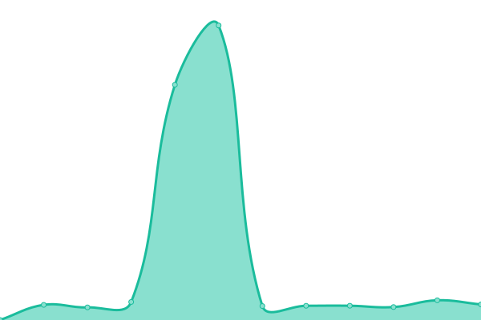

# [📈 Live Status](https://gdm257.github.io/upptime): <!--live status--> **🟩 All systems operational**

This repository contains the open-source uptime monitor and status page for [gdm257](https://gdm257.github.io/upptime), powered by [Upptime](https://github.com/upptime/upptime).

With [Upptime](https://upptime.js.org), you can get your own unlimited and free uptime monitor and status page, powered entirely by a GitHub repository. We use [Issues](https://github.com/gdm257/upptime/issues) as incident reports, [Actions](https://github.com/gdm257/upptime/actions) as uptime monitors, and [Pages](https://gdm257.github.io/upptime) for the status page.

<!--start: status pages-->
<!-- This summary is generated by Upptime (https://github.com/upptime/upptime) -->
<!-- Do not edit this manually, your changes will be overwritten -->
<!-- prettier-ignore -->
| URL | Status | History | Response Time | Uptime |
| --- | ------ | ------- | ------------- | ------ |
|  [Disroot](https://cloud.disroot.org) | 🟩 Up | [disroot.yml](https://github.com/gdm257/upptime/commits/HEAD/history/disroot.yml) | 

 1476ms
     
 | 

<a href="https://gdm257.github.io/upptime/history/disroot">100.00%</a>
    

|  [Fileio](https://file.io) | 🟩 Up | [fileio.yml](https://github.com/gdm257/upptime/commits/HEAD/history/fileio.yml) | 

 691ms
     
 | 

<a href="https://gdm257.github.io/upptime/history/fileio">100.00%</a>
    

|  [PasteBin](https://pastebin.com) | 🟩 Up | [paste-bin.yml](https://github.com/gdm257/upptime/commits/HEAD/history/paste-bin.yml) | 

 442ms
     
 | 

<a href="https://gdm257.github.io/upptime/history/paste-bin">99.61%</a>
    

|  [ZeroBin](https://zerobin.net) | 🟩 Up | [zero-bin.yml](https://github.com/gdm257/upptime/commits/HEAD/history/zero-bin.yml) | 

 2484ms
     
 | 

<a href="https://gdm257.github.io/upptime/history/zero-bin">90.49%</a>
    

|  [EncryptedPastebin](https://defuse.ca/pastebin.htm) | 🟩 Up | [encrypted-pastebin.yml](https://github.com/gdm257/upptime/commits/HEAD/history/encrypted-pastebin.yml) | 

 277ms
     
 | 

<a href="https://gdm257.github.io/upptime/history/encrypted-pastebin">100.00%</a>
    

|  OpenList | 🟩 Up | [open-list.yml](https://github.com/gdm257/upptime/commits/HEAD/history/open-list.yml) | 

 2337ms
     
 | 

<a href="https://gdm257.github.io/upptime/history/open-list">95.29%</a>
    

|  Matrix | 🟩 Up | [matrix.yml](https://github.com/gdm257/upptime/commits/HEAD/history/matrix.yml) | 

 1714ms
     
 | 

<a href="https://gdm257.github.io/upptime/history/matrix">94.87%</a>
    

<!--end: status pages-->

[**Visit our status website →**](https://gdm257.github.io/upptime)

## 📄 License

- Powered by: [Upptime](https://github.com/upptime/upptime)
- Code: [MIT](./LICENSE) © [gdm257](https://gdm257.github.io/upptime)
- Data in the `./history` directory: [Open Database License](https://opendatacommons.org/licenses/odbl/1-0/)
